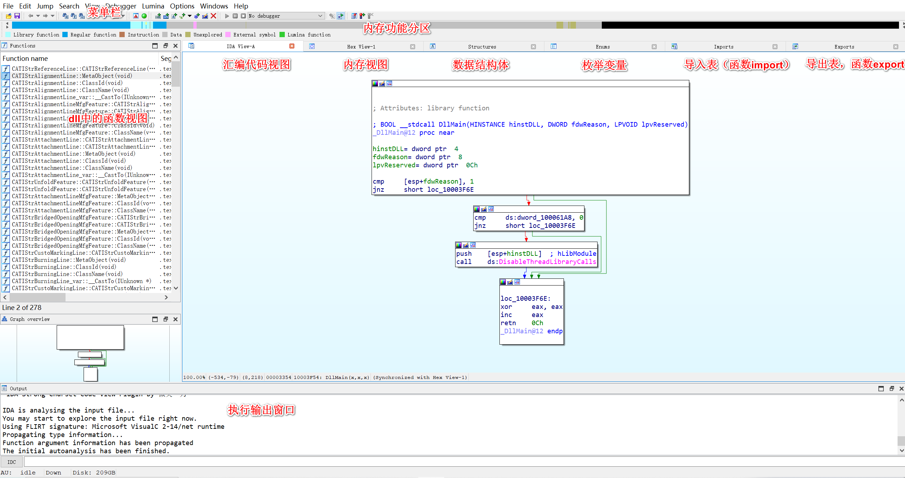
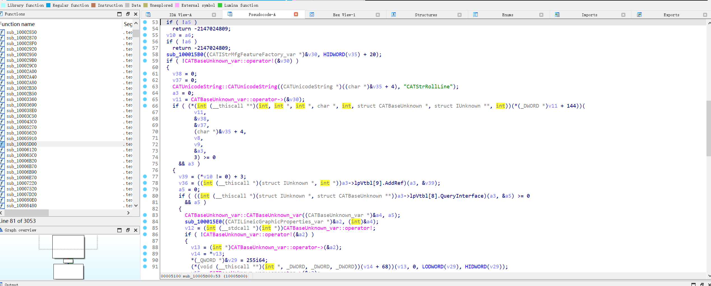
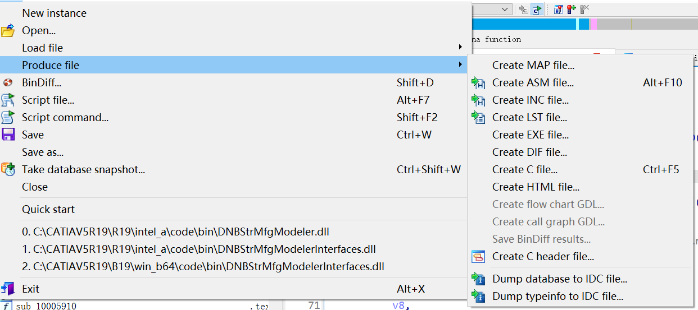
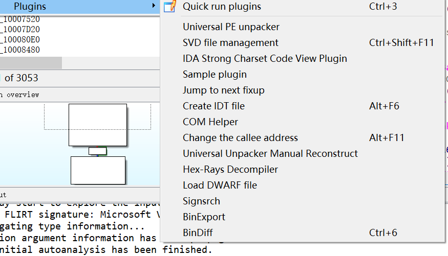
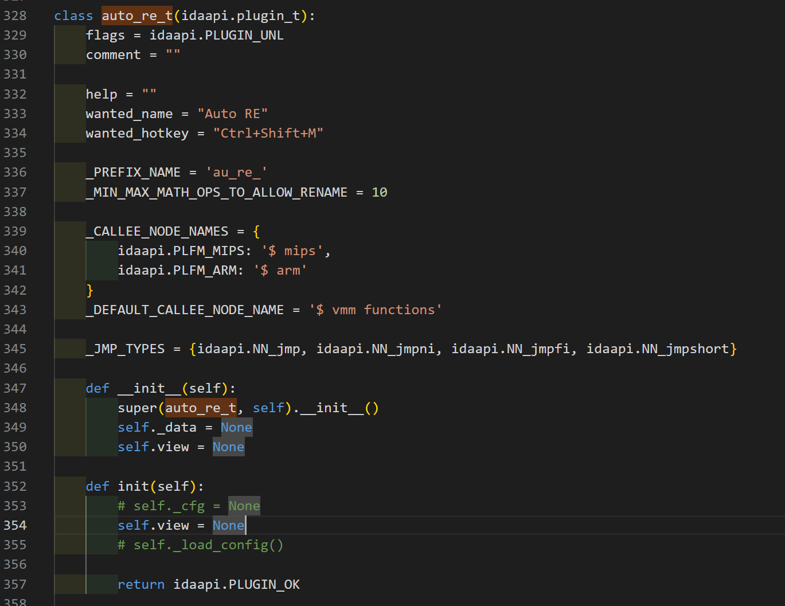
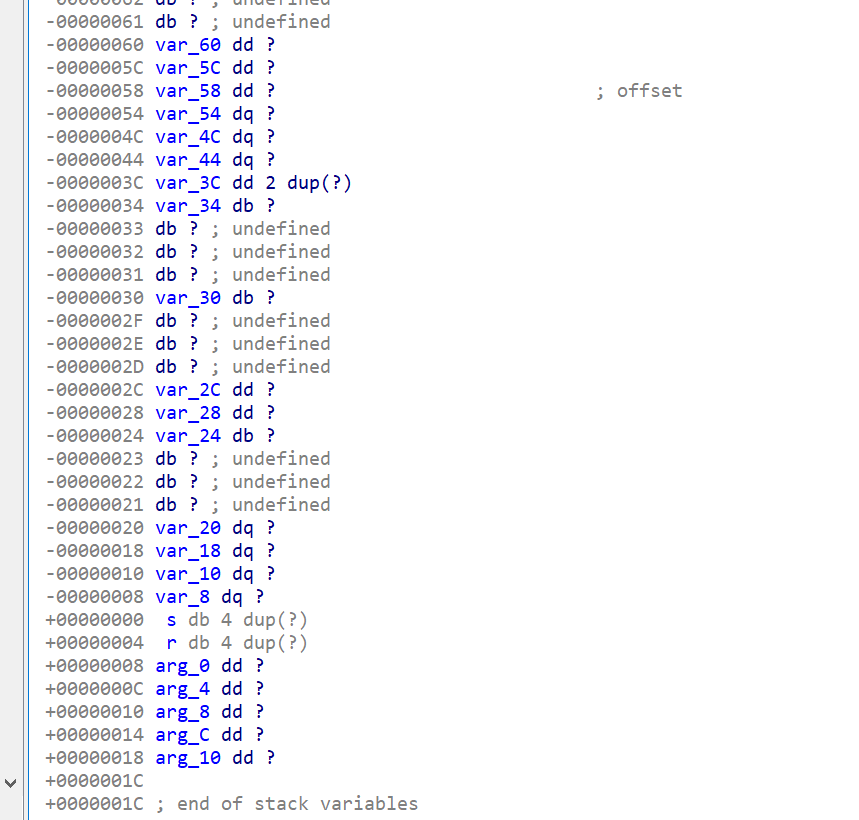
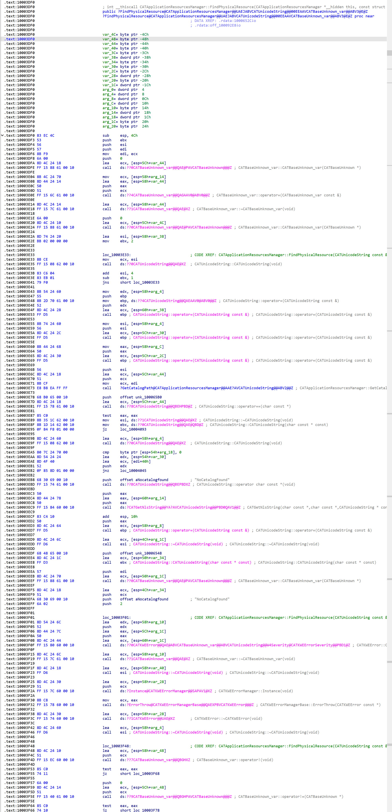
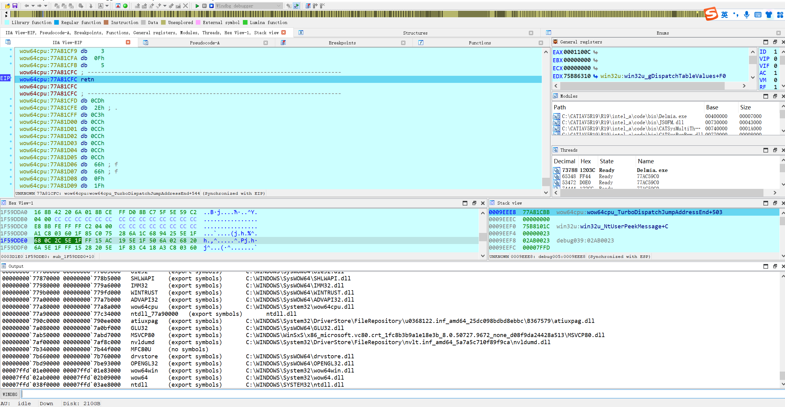

[toc]
# IDA实战入门

## 前言

本人近期由于工作需要，做了一点反汇编工作，在学习使用IDA软件时，发现百度等搜索引擎上的教学稀少，官方文档与参考书籍大而全但是是重点不突出，对于想要快速进入工作状态的初学者不够友好。
现有资料难以入手，实用性不强。所以总结了一点使用经验，由于个人水平有限，行文难免出现纰漏和错误，望大家不吝指正。
本文使用的IDA版本为7.7；系统平台为win10；分析的dll来自CATIA。所有的汇编格式均为intel格式
建议在初步了解IDA之后阅读《IDA Pro 权威指南（第二版）》

## IDA基础功能

### 常用功能与快捷键介绍【F5\F7\F8\F9\Ctrl+x\Tab】

在我们使用ida打开一个dll之后（注意使用对应的ida版本打开对应的32位或者64位dll），会出现下面的程序视图；大致分为以下几个区域

在这些区域中，我们要着重分析和了解的，当属汇编代码区域和反汇编伪代码区域，这是我们分析源代码逻辑和理解程序编译运行必不可少的部分。
针对以上目的，我们首先介绍F5。

#### F5
F5的反汇编输入：我们知道，不同的程序由于硬件平台（芯片）使用的指令集不同，所生成的二进制文件也不同。例如X86使用CISC（复杂指令集），而ARM使用RISC；针对不同的指令集生成的程序，需要使用不同的反汇编器进行处理，例如X86的程序可以使用dumpbin。

F5的反汇编输出：F5根据dll提取出的汇编指令将代码重新分析组合为c语言代码（伪代码），方便阅读与使用。

我们在函数中随便选取一个，选中函数地址，使用F5，得到对应的伪代码

#### F7\F8\F9\Ctrl+x\Tab
静态分析阶段常用快捷键：

Ctrl+x：查找当前选择对象的引用（常用于查找函数被谁调用）
Tab：跳转找到对应的汇编、反汇编代码

动态调试阶段常用快捷键：
F7:step into(进入函数，类似于vs的F11)
F8：step over（单步调试，类似于vs的F10）
Ctrl+F7 :运行到ret
F9：go(类似于vs的F5)

### load & produce file
有时候，我们仅仅分析一个dll还不够，为了建立更加完成的工作流程；我们需要辅助的输入或者输出

loadfile：
load idc(用于带入其他dll输出的数据结构定义)；
load pdb（用于导入调试符号，可以辅助分析匿名函数，辅助调试）

produce：
produce idc（输出已经定义完成的数据结构）
produce c file（输出所有的伪代码，常用于统计伪代码函数与工作量）

### 常用设置
debugger设置：
ida提供多种调试器的选择，我们常用的调试器包括local windows debugger和windbg

插件设置：
ida中Edit -- plugin提供了插件的执行入口，我们可以在对应的plugin文件夹中放入插件，并设置好快捷键

数据结构设置：
跨dll之间会有通用的数据结构，可以通过idc文件的输出、输入完成结构的迁移设置

高级设置：
如果你希望ida在反汇编器、预设处理器方面完全符合你的使用习惯，可以使用ida.cfg进行修改保存，在ida启动的时候，会读取该文件。
同样，关于快捷键等简单设置可以通过idagui.cfg进行配置

## IDA插件
尽管IDA的功能已经非常强大，但是面对一些个性化的需求，仍然不够方便与高效；所以，我们需要对ida打补丁，方法就是编写可以在IDA上运行的插件。IDA也提供了多种实现插件的方式。

### Python插件使用
Python作为一种广受欢迎的脚本语言，ida也予以了良好的支持，对于Python的脚本使用，我们仅仅需要将python文件放到ida目录下的plugins文件夹中，重启ida即可在插件目录中可以看见（注意7.7默认支持Python 3，请尽量使用Python 3的脚本）

### IDC\python插件开发
当然，很多情况下，我们可能并不能找到对应的脚本，这时候就需要我们自己开发。
除了Python，ida还支持一种自己的脚本语言，叫idc，使用idc与使用python的开发流程十分的接近；
使用idc进行插件开发具体的接口可以参考ida里自带的idc.idc文件
使用python进行脚本的制作，可以参考\IDA_Pro_7.7\python\3里面的函数和IDA_Pro_7.7\python\examples里面的参考

我们可以参考一个简单的插件，分析python脚本的书写结构：
首先，我们需要引入ida的python接口模块：

然后，新建ida调用的的入口函数

完成脚本的调用设置和功能函数的书写：

### c++ sdk插件开发
尽管idc与python脚本已经可以满足绝大部分的要求，但是如果你需要更加强大的插件，那么，使用sdk二次开发的方式或许可以满足你。
我们需要新建一个vs工程，使用ida提供的sdk生成dll，然后集成到ida中即可
和所有的二次开发一样，我们要先熟悉ida开放给我们的接口，它定义在\IDA_Pro_7.7\SDK77\SDK77中，一般会在ida本体中以压缩包的形式附带，解压查看即可
在开发的时候，我们需要先定义一个结构体，用于接入程序的运行。

## 反编译基础流程

### 确定需要分析的具体dll与具体函数入口
dll与函数的确定往往与业务强相关，也可以使用面板、提示信息、资源文件、异常信息进行辅助定位。

### 确定需要使用的头文件
如果我们逆向的程序已经提供了二次开发的接口，那么无疑对我们的工作可以提供巨大的帮助，
我们可以从这些二次开发的头文件中提取出接口功能、结构体定义、模块层次、代码结构等一些重要信息。
所以分析官方提供的头文件也是十分重要的。

### 确定接口与类的虚表结构
由于在dll的静态分析中，会出现很多的函数调用，包括很多的虚函数调用，我们可以使用头文件先输出基于头文件提取的虚表。
在寻找函数时，仅仅计算偏移即可，这样可以极大程度减轻工作量。

### 输出当前的伪代码
这里通常有两个作用：
1是ida的伪代码每次打开狗不一定完全一致，包括临时变量重命名和不可预知的错误，为了保证你的分析可以被溯源，所以强烈建议输出伪代码文件
2是为了更加直观的估计需要分析的代码量级

### 重命名与结构定义
从这里开始就正式进入了分析的步骤，主要定义的内容分为enum和structure；当然，C++的类也需要定义到structure里面；
定义结构的依据来自对程序的分析理解和头文件的成员结构解析

### 修改伪代码异常
由于ida反编译的伪代码并不是立即可用的，所以需要我们进行一些基础的排错。此部分的内容在ida异常中。

### 修改伪代码编译问题
使用编译器编译修改之后的伪代码，修正编译错误。

### 导出定义结构
导出分析成果。推荐导出idc文件

## ida异常
### 未定义参数

### 未定义类型

### 栈平衡异常
栈平衡异常一般是出现在32位的程序反编译过程中，由于寻址方式是esp+offset的方式，所以起始寻址的位置就格外的重要，在ida中，寻址的表示方式为：[esp+100h+var_F0]
其中这个100h就是当前的起始寻址位置。由于32位中使用push向栈内传递参数，使用ret x和pop退栈，所以常见的流程是在调用funA之前，push一个int大小的参数，调用完成ret 4，程序执行完的时候，栈顶仍然是100h。但是由于某些因素，可能会导致这个平衡计算的过程失衡，就会使得后续寻址取出来的变量错位。
例如：

## 简单阅读汇编代码

### 调用函数时的内存分布

### 函数变量与参数

### 调用方式（调用约定）
调用约定部分可以参考《cpp-cpp-msvc-170》
#### 32位调用约定
stdcall:
C++的标准调用方式,传参方式从右到左。
函数返回时使用retn x指令（x为字节数，同时也意味着参数固定）。被调用者释放资源，速度快于cdcall

cdcal:
C语言默认的函数调用方式,缺省调用方式。传参方式从右到左。
函数返回时作用ret指令（支持可变参数）。调用者释放资源，需要考虑栈平衡。

ps：编译后函数的修饰名不同： 假设有函数int foo(int a, int b), 采用__stdcall编译后的函数名为_foo@8，而采用__cdecl编译后的函数名为_foo。

thiscall:
C++内部成员函数调用，函数参数的入栈顺序为从右到左入栈。
一般使用寄存器ECX传递（Borland的C++编译器使用eax），如果参数个数确定，this指针通过ecx传递给被调用者；如果参数不确定，this指针在所有参数被压栈后压入栈堆

fastcall:
通过通过寄存器来传送参数（ECX和EDX）其余参数从右向左入栈。
由调用者清理堆栈。

userpurge:
用户自定义的调用方式（多见于ida难以分析的汇编代码）

nakedcall:
这个调用比较特殊，在使用其他调用约定时，如果必要的话，进入函数时编译器会产生代码来保存ESI，EDI，EBX，EBP寄存器，退出函数时则产生代码恢复这些寄存器的内容。naked call不产生这样的代码。naked call不是类型修饰符，故必须和_declspec共同使用。

#### 64位调用约定
64位常用RCX\RDX\R8\R9进行传参，其他参数在栈上，葱油向左传参，RAX通常为返回值。

### 常用汇编指令（intel）
源操作数在右边(与ATT相反),仅列举常见的部分
MOV　　传送字或字节
PUSH　　把字压入堆栈.
POP　　把字弹出堆栈.
IN　　　I/O端口输入.
OUT　　I/O端口输出. 
LEA　　装入有效地址.
ADD　　加法.
ADC　　带进位加法.
INC　　加 1.
SUB　　减法.
DEC　　减 1.
NEC　　求反(以 0 减之).
CMP　　比较.(两操作数作减法,仅修改标志位,不回送结果).
DIV　　无符号除法.
AND　　与运算.
OR　　　或运算.
XOR　　异或运算.
NOT　　取反.
TEST　　测试.(两操作数作与运算,仅修改标志位,不回送结果).
SHL　　逻辑左移.
SAL　　算术左移.(=SHL)
SHR　　逻辑右移.
SAR　　算术右移.(=SHR)
JMP　　无条件转移指令
CALL　　过程调用
RET/RETF过程返回.
JE/JZ　等于转移.
JNE/JNZ 不等于时转移.
LOOP　　　　　　CX不为零时循环.
INT　　中断指令
IRET　　中断返回
DW　　　定义字(2字节).
ENDS　　段结束.
END　　程序结束.

### 32位程序与64位程序的反编译区别
我们先对比一下同一个函数在32位dll和64位dll中的区别

1.寻址方式区别
32位使用esp+offset的方式寻址；用于寻址的指针是变化的
64位多用ebp+offset的方式寻址；用于寻址的指针是固定的

2.栈空间开辟区别
32位使用push对函数参数入栈，而64位直接开辟好所有的地址

3.使用调用约定的区别，64位使用X64调用约定，在ida中翻译为fastcall；而32位的调用约定参考上文“调用方式”

## 使用IDA动态调试
ida可以支持多种调试器进行动态的调试。在windows中常用的是windbg和local debugger。 

### 使用local debugger
一些简单的操作：

### 使用windbg
使用windbg时，我们可以使用windbg的调试窗口和windbg的命令

windbg的参考资料详见《》

## 参考资料
《IDA Pro 权威指南（第二版）》
《cpp-cpp-msvc-170》